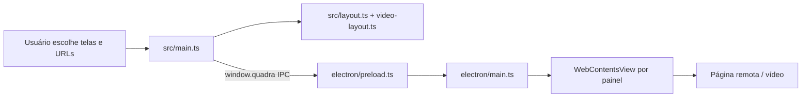

# Onboarding — Quadra Multi-view

## Resumo

Quadra é um aplicativo desktop Windows feito com Electron. Ele abre de 1 a 16 páginas independentes em uma única janela, usando um `WebContentsView` do Chromium por painel. A UI controla a composição; o processo principal cria, posiciona, silencia, recarrega e destrói os conteúdos remotos.

O diretório pai também contém `../comparacoes-layouts/`, um relatório offline separado que extrai a geometria de `src/layout.ts` e compara 124 combinações de layout. Não é outro backend nem outro aplicativo.

## Quick start

No diretório `multiview/`:

```bash
npm install
npm run dev
```

Para gerar o executável/instalador Windows:

```bash
npm run build
npm run dist
```

O instalador sai em `release/`. O script `abrir-quadra-atual.cmd` também automatiza build e abertura do app local.

Validações principais:

```bash
npm run typecheck
npm test
npm run test:renderer
npm run test:toolbar
npm run test:app
npm run test:close
npm run test:packaged
```

## Arquitetura

- `electron/main.ts`: processo principal. Cria uma `BaseWindow` preta e maximizada, uma `BrowserWindow` transparente de overlay para os controles e um `WebContentsView` para cada URL carregada.
- `electron/preload.ts`: bridge segura `window.quadra`, expondo somente comandos/eventos IPC necessários.
- `src/main.ts`: renderer vanilla TypeScript/DOM. Mantém painéis, URLs, rascunhos, mute, destaques, organização, undo, fullscreen e toolbar auto-hide.
- `src/layout.ts`: árvore binária de divisões, catálogo de composições de 1–16 telas, destaques e posições; calcula e valida retângulos normalizados.
- `src/video-layout.ts`: otimização dos ratios dos splits com `yalps`, buscando ampliar vídeo 16:9 sem reduzir vídeos existentes nem perder a hierarquia de destaques; cache RAM de 256 resultados.
- `src/organizer.ts`: rascunho do editor de organização, validação, miniaturas e agrupamento de posições equivalentes.
- `src/routing.ts`: normaliza URLs, extrai `iframe`, adiciona HTTPS e converte formatos comuns do YouTube para URLs `watch`.
- `src/style.css`: tema e layout visual, transparência dos painéis, toolbar, editor, responsividade e acessibilidade básica.

Fluxo real:



O renderer envia bounds reais do DOM. O main valida o payload e reaproveita views existentes por `panelId`; reorganizar, redimensionar, mutar ou mudar a toolbar não deve recriar a página. O overlay fica transparente e alterna `setIgnoreMouseEvents` para deixar cliques passarem ao vídeo quando o cursor não está sobre controles.

## Dados e persistência

Não há banco, ORM, schema de aplicação, migration, seed, API server ou repositório de dados. As estruturas são apenas tipos e estado em memória:

- `Panel = { id, url, draftUrl, muted }`;
- `LayoutNode = leaf | split`, `Bounds`, `LayoutPayload` e `PanelPayload` formam o contrato de layout/IPC;
- `LayoutSnapshot` mantém undo em memória, limitado a 24 estados;
- `OrganizerDraft` e `OrganizerChoice` existem apenas durante a prévia;
- `slotViews` associa `panelId` a `WebContentsView` viva;
- o cache do otimizador também é apenas RAM.

Ao fechar o programa, painéis, URLs, composição e histórico são destruídos. A única persistência deliberada é a sessão Chromium `persist:quadra`, compartilhada pelo catálogo e pelos players do WeddBets, para manter cookies/login/localStorage. Isso pertence ao Electron, não a um modelo de dados do Quadra.

## API, IPC e rede

Não existe REST, GraphQL, tRPC ou servidor local de negócio. A API interna é IPC entre renderer/preload/main:

| Canal | Direção | Função |
|---|---|---|
| `quadra:ready` | renderer → main | sinaliza renderer pronto |
| `quadra:set-layout` | renderer → main | envia modo, URLs, mute, edição e bounds |
| `quadra:set-chrome-interactive` | renderer → main | habilita/desabilita interação do overlay |
| `quadra:set-fullscreen` | renderer → main | alterna fullscreen nativo |
| `quadra:set-cursor-hidden` | renderer → main | esconde cursor nos conteúdos |
| `quadra:open-weddbets` | renderer → main | abre catálogo WeddBets para um painel |
| `quadra:set-weddbets-target` | renderer → main | seleciona o painel destino |
| `quadra:request-layout` | main → renderer | pede recálculo de bounds |
| `quadra:fullscreen-changed` | main → renderer | informa mudança de fullscreen |
| `quadra:weddbets-player-opened` | main → renderer | entrega URL do player ao painel escolhido |
| `quadra:weddbets-target-required` | main → renderer | informa que falta escolher um painel |
| `quadra:weddbets-error` | main → renderer | relata falha de catálogo/player |

O main só aceita comandos enviados pelo overlay. URLs carregadas nos painéis precisam ser HTTP(S), têm limite de 4096 caracteres e navegações não HTTP(S) são bloqueadas. Conteúdos remotos são páginas Chromium completas, não iframes; por isso páginas com `X-Frame-Options: DENY` continuam podendo abrir como view direta.

## Autenticação e autorização

O Quadra não tem contas, login próprio, roles, permissões ou middleware de usuário. O acesso é local ao executável. A separação de privilégios vem do Electron (`contextIsolation`, `nodeIntegration: false`, `sandbox: true` nos conteúdos remotos) e da checagem de que IPC veio do overlay.

O login do WeddBets é feito pelo próprio site dentro da sessão persistente `quadra`. O Quadra não lê senha nem implementa token; apenas roteia o catálogo e URLs `/view/<id>` para o painel selecionado.

## Build e distribuição

- Electron `^44.4.0`, Electron Vite `^5`, Vite `^7`, TypeScript `~6`.
- Única dependência de runtime: `yalps 0.6.4` para otimização linear/MIP dos layouts.
- `electron.vite.config.ts` separa bundles main, preload e renderer; dev/preview usam a porta `43123`.
- `electron-builder` gera NSIS Windows com appId `com.quadra.multiview`, produto `Quadra`, ícone `public/quadra.ico` e saída em `release/`.
- `QUADRA_WEDDBETS_URL` substitui a URL do catálogo; `QUADRA_TEST_USER_DATA` isola o perfil Chromium em testes.

## O que o usuário consegue fazer

1. Escolher 1–16 telas ou começar com uma.
2. Colar URLs comuns, links/embeds do YouTube ou usar o catálogo WeddBets.
3. Abrir um painel ou todos, editar/limpar URLs, adicionar/remover telas e mutar individualmente/coletivamente.
4. Destacar jogos; o algoritmo redistribui os demais conforme quantidade e proporção da janela.
5. Abrir o editor, selecionar composição, telas principais e posição; aplicar/cancelar com undo.
6. Alternar layout automático/equal, fullscreen, voltar ao seletor e usar toolbar que desaparece após 10 segundos ociosa.

## Testes e limites conhecidos

O `typecheck`, `npm test` e o build passam no estado analisado. Os testes unitários cobrem routing, layouts até 16 painéis, 124 combinações de composição/posição, editor, otimização, histerese e validação geométrica. Os smokes Electron cobrem WeddBets, múltiplas views, `X-Frame-Options`, fechamento e executável empacotado.

O próprio README/DIAGNOSTICO registra limites: URLs inválidas ainda não têm validação de UX completa; há casos de reabertura da mesma URL, mensagens genéricas de navegação e perda de parâmetros em alguns links do YouTube. Reprodução, áudio e desempenho de serviços externos dependem do ambiente real e não são garantidos pelos testes locais.

## Arquivos para começar

- `README.md` — uso e decisões funcionais.
- `electron/main.ts` — integração Electron, segurança de navegação, WeddBets e ciclo de vida.
- `src/main.ts` — fluxo completo da UI.
- `src/layout.ts` — regras de composição e geometria.
- `src/video-layout.ts` — solver que redistribui os painéis.
- `tests/app-integration.cjs` — fluxo integrado do produto.
- `tests/layout.test.ts` e `tests/organizer.test.ts` — contrato geométrico/editor.
- `../comparacoes-layouts/LEIA-ME.txt` — relatório offline das 124 comparações.
